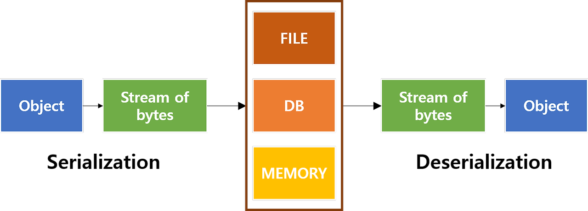

# 📌 딥다이브


## ✅ 직렬화 (Serialization)
> **데이터 객체를 저장 매체에 저장할 수 있는 형식** OR **네트워크를 통해 전송할 수 있는 것**으로 변환하는 과정

## ✅ 역직렬화 (Deserialization)
> **저장된 데이터를 읽거나 네트워크 통신으로부터 받은 데이터를 다시 객체로 변환하는 과정**.


<br>
<br>




<br>


## 직렬화가 필요한 이유

프로그래밍 언어에서 데이터를 다룰 때 **메모리 구조**는 크게 두 가지로 나뉜다.
>
1. **값 형식 데이터** (Primitive Type)  
   - `int`, `float`, `char` 등의 기본 데이터 타입
   - **Stack 메모리에 저장**되며 직접 접근 가능 
   <br>
2. **참조 형식 데이터** (Reference Type)  
   - `객체(Object)`와 같은 참조형 데이터
   - **Heap 메모리에 저장**되고, Stack 영역에서 이 Heap 메모리를 참조하는 방식

- **직렬화가 필요한 이유는 참조 형식 데이터를 직접 저장하거나 전송할 수 없기 때문!**  

- 프로그램이 종료되면 Heap 메모리에 있던 객체가 사라지므로, **객체의 주소값(메모리 위치)만 저장하면 의미가 없다.**  

- **직렬화를 통해 객체 데이터를 값 형식으로 변환해야 영구 저장하거나 다른 환경에서 활용할 수 있다.**  

<br><br>

---
## 데이터 직렬화 방식

### 1. 텍스트 기반 데이터 직렬화 (Text-Based Data Serialization)

- 사람이 읽을 수 있는 형태.
- 저장 공간을 많이 차지하고, 파싱(Parsing) 속도가 느림.
- **주로 JavaScript에서 사용 (JSON 직렬화)**
- **예시:** XML, CSV, `JSON`, YAML 등.

 
### 2. 바이너리 기반 데이터 직렬화 (Binary Data Serialization)

- 사람이 읽을 수 없는 형태.
- 저장 공간을 절약하고, 파싱 속도가 빠름.
- **주로 Java에서 사용 (객체 직렬화, Protocol Buffers 등)**
- **예시:** Java의 `Serializable`, Protobuf, MessagePack 등.

### JSON 직렬화, 역직렬화 예시
```javascript
const user = {
  name: "Alice",
  age: 25,
  isAdmin: true
};

// 객체 → JSON 문자열 (직렬화)
const jsonString = JSON.stringify(user);
console.log(jsonString);
// 출력: {"name":"Alice","age":25,"isAdmin":true}

// JSON 문자열 → 객체 (역직렬화)
const parsedObject = JSON.parse(jsonString);
console.log(parsedObject);
// 출력: { name: 'Alice', age: 25, isAdmin: true }

```


