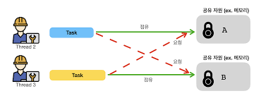

# 🎯 학습한 내용

## 데드락(Deadlock)
> 둘 이상의 프로세스가 다른 프로세스가 점유하고 있는 자원을 서로 기다릴 때 무한 대기에 빠지는 상황

한 스레드가 A 자원을 점유한 상태에서 B를 기다리고, 다른 스레드가 B를 점유하며 A를 기다릴 경우 시스템이 멈출 수 있다.

 

### 🔍 데드락 발생 조건

데드락이 발생하려면 다음 **4가지 조건이 동시에 만족**해야 한다.

 

1️⃣ **상호 배제 (Mutual Exclusion)**  
   - 한 번에 **프로세스 하나만 해당 자원을 사용할 수 있음**  
   - 사용 중인 자원을 다른 프로세스가 사용하려면 해제될 때까지 기다려야 함  

2️⃣ **점유와 대기 (Hold and Wait)**  
   - 프로세스가 **이미 할당된 자원을 점유한 상태에서** 추가적인 자원이 해제되기를 기다리는 상태  

3️⃣ **비선점 (No Preemption)**  
   - 이미 할당된 자원을 **강제로 빼앗을 수 없음**  

4️⃣ **순환 대기 (Circular Wait)**  
   - 대기 중인 프로세스들이 **순환 형태로 자원을 대기**하고 있어야 함  
   - (예제)
     - 프로세스 A가 자원 X를 점유하고 자원 Y를 기다림
     - 프로세스 B가 자원 Y를 점유하고 자원 Z를 기다림
     - 프로세스 C가 자원 Z를 점유하고 자원 X를 기다림  
     - **A → B → C → A** 형태의 **순환 대기 발생 → 데드락!**  

 

### 🔍 데드락 예방 방법
**데드락 발생 조건 4가지 중 하나라도 발생하지 않도록 하면 데드락을 예방할 수 있다.**

| 예방 방법 | 설명 |
|-----------|--------------------------------------------------|
| **자원의 상호 배제 조건 방지** | 한 번에 여러 프로세스가 공유 자원을 사용할 수 있도록 설계 |
| **점유 대기 조건 방지** | 프로세스가 실행되기 전에 필요한 모든 자원을 할당 |
| **비선점 조건 방지** | 높은 우선순위의 프로세스가 자원을 선점할 수 있도록 허용 |
| **순환 대기 조건 방지** | 자원 요청 순서를 정하고, 한 방향으로만 요청 가능하도록 제한 |

  

---
## 자원 경합(Race Condition)

> 여러 개의 프로세스(또는 스레드)가 동시에 공유 자원에 접근할 때, 실행 순서에 따라 **예기치 않은 결과**가 발생하는 문제

### 🚀 자원 경합 vs. 데드락 비교

| 개념 | 설명 | 발생 원인 | 예제 |
|------|------|----------|------|
| **자원 경합 (Race Condition)** | 실행 순서에 따라 다른 결과가 나오는 문제 | 여러 스레드가 동시에 공유 자원을 변경 | React 상태 업데이트 문제, 은행 계좌 잔액 동기화 문제 |
| **데드락 (Deadlock)** | 프로세스들이 서로 자원을 기다리며 멈춰버리는 상황 | 순환 대기 발생 | 한 프로세스가 X를 점유하고 Y를 기다리는 동안, 다른 프로세스가 Y를 점유하고 X를 기다림 |

### 💡 관계 정리
✔ **자원 경합** → 비결정적 동작 문제(데이터 무결성 깨짐, UI 이상 동작 등)  
✔ **데드락** → 프로세스들이 영원히 멈추는 문제

 

즉, **자원 경합을 해결하려는 과정**에서 잘못된 락 관리가 이루어지면 **데드락**이 발생할 수 있다.

  
