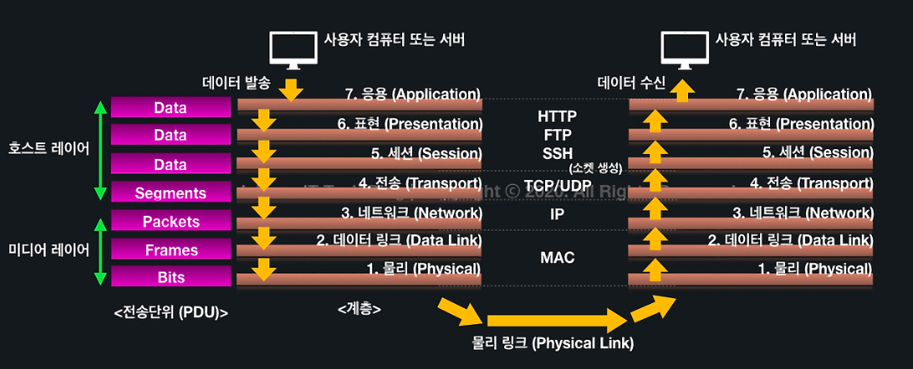
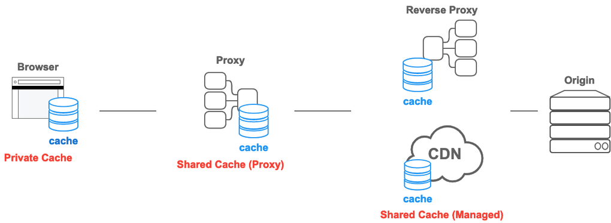

# 🎯 학습한 내용

## 클라이언트와 서버

- **클라이언트**: 서버에게 요청하는 컴퓨터, 브라우저 등 앱
- **서버**: 클라이언트의 요청에 응답을 해주는 컴퓨터 또는 프로그램
    

---

## DNS

> 인터넷 **도메인 이름을 IP 주소로 변환**하는 시스템

예를 들어, www.google.com의 IP 주소는 `142.250.196.110`, 따라서 브라우저에서 https://142.250.196.110 를 입력하여 www.google.com에 접속할 수 있다.

이때 `DNS(Domain Name System)`가 도메인 이름과 IP 주소 사이의 변환을 관리한다.

  

---

## OSI 7계층

> **네트워크 통신**이 일어나는 일련의 과정들을 7단계로 나눈 것

 

 

1️⃣ **물리 계층 (Physical Layer)**

- 전기적 신호가 나가는 **물리적인 장비**
- 전송하려는(받으려는) 데이터가 무엇인지, 어떤 에러가 있는지 등에 대해서는 신경쓰지 않는다.

2️⃣ **데이터 링크 계층 (Data Link Layer)**

- 물리계층을 통해 송수신되는 **정보의 오류와 흐름을 관리**하여 안전한 정보 전달

3️⃣ **네트워크 계층 (Network Layer)**

- 경로(Route)와 주소(IP)를 정하고 패킷을 전달해주는 것(**라우팅**)

4️⃣ **전송 계층 (Transport Layer)**

- 양 끝단의 사용자들 간의 신뢰성있는 데이터를 주고 받게 해주는 역할
- **`TCP와 UDP`**
  
5️⃣ **세션 계층(Session layer)**

- TCP/IP 세션을 만들고 없애는 역할

6️⃣ **표현 계층(Presentation layer)**

- **데이터의 암호화, 복호화, 압축**

7️⃣ **응용 계층(Application layer)**

- 우리가 사용하는 응용 서비스나 프로세스
-  **HTTP, FTP**
  
  

---

## TCP와 UDP

- ### TCP
  > 신뢰성을 보장하는 **연결형** 서비스 (데이터를 안정적으로, 순서대로, 에러없이 양방향 교환)  
  
  > ex) 웹 브라우저(HTTP, HTTPS), 이메일

  - #### `3-way Handshake`
    - **TCP**에서 안정적인 연결을 맺기 위해 **클라이언트와 서버가 3단계를 거쳐 연결을 설정**하는 과정  
    - 신뢰성 있는 연결을 보장하기 위해, 클라이언트와 서버가 서로 준비 상태를 확인하기 위해 사용
  
  
- ### UDP
  > 신뢰성을 보장하지 않는 **비연결형** 서비스 (데이터를 빠르고 간단하게 단방향 전송)  
  
  > ex) 온라인 게임, 라이브 스트리밍
    

  

---

## CDN
  > 웹 콘텐츠를 빠르고 안정적으로 제공하기 위해 전 세계 여러 지역에 분산된 서버 네트워크

  > 사용자와 가까운 서버에서 콘텐츠를 제공하여 로딩 속도를 줄이고 성능을 최적화할 수 있다.

  

---

## HTTP / HTTPS

  - ### HTTP
    > 웹 브라우저와 서버가 데이터를 주고받는 프로토콜  
  
  
- ### HTTPS
  > HTTP에 인증과 암호화를 적용해 보안을 강화시킨 통신 규약  

  - #### `SSL/TLS`
    - HTTP에 인증서와 암호화를 적용시켜 보안을 강화하게 만드는 기술  
    - HTTPS = HTTP + TLS
    - SSL은 구버전이며, 현재는 보안이 강화된 TLS 사용

      
  

---

## HTTP Cache
  > 웹 페이지, 이미지, 기타파일 등 웹 리소스들을 사용자의 브라우저나 서버에 임시로 저장해두는 기술

 

#### 1️⃣ Private Cache
웹 브라우저에 저장되는 캐시이며, 다른 사람이 접근할 수 없다. 

#### 2️⃣ Shared Cache
웹 브라우저와 서버 사이에서 동작하는 캐시

#### 3️⃣ Proxy Cache
(포워드) 프록시에서 동작하는 캐시

#### 4️⃣ Managed Cache
CDN 서비스 그리고 리버스 프록시에서 동작하는 캐시

 

### Cache-Control 헤더
  > 웹 서버와 브라우저 간에 캐시 동작을 제어하기 위해 사용  
    이 헤더를 통해 웹 서버는 브라우저에게 특정 자원을 얼마나 오랫동안 캐시해야 하는지, 언제 새로고침해야 하는지 등의 지시를 할 수 있다. 

 - `no-cache`: 자원을 요청할 때 서버에 항상 캐시 유효성 검증을 하는 옵션
 - `no-store`: 자원에 대해 캐싱 금지 
 - `must-revalidate`: 캐시된 자원이 만료되었을 때, 서버에 재검증 지시
 - `max-age=<초>`: 캐시 유지 시간 설정 (초 단위)
 - `private`: 자원이 사용자의 브라우저와 같은 프라이빗 캐시에만 저장
 - `public`: 자원이 공개 캐시(프록시 서버)에 저장

