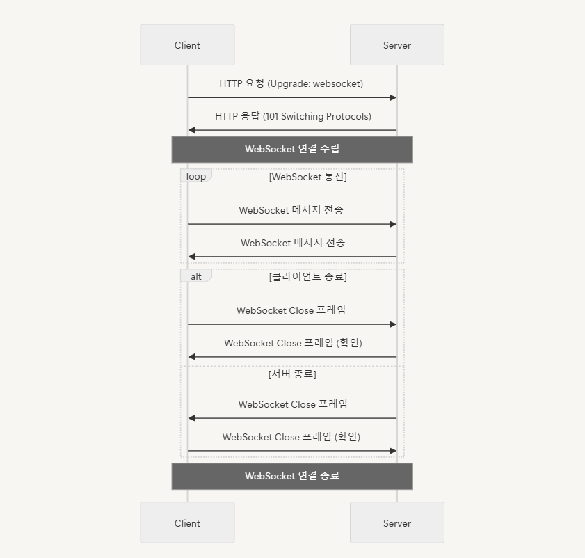

# 🎯 학습한 내용

## 웹 소켓

> **실시간 양방향 통신**을 위해 웹 애플리케이션과 서버 간의 지속적인 연결을 제공하는 프로토콜

- `HTTP`와는 달리, `WebSocket` 연결은 **한 번 열린 후 계속 유지**되므로, 서버나 클라이언트에서 언제든지 데이터를 전송할 수 있다.

- `HTTP`는 클라이언트가 서버에게 요청하지 않는 이상 서버는 클라이언트에게 먼저 데이터를 보낼 수 없다.

- 하지만 `WebSocket`은 클라이언트와 서버 간에 최초 연결이 이루어지면, **서버도 클라이언트에게 먼저 데이터를 보낼 수 있다.**

- 실시간 웹 게임, 채팅 애플리케이션, 금융 거래 모니터링 시스템 등에서 주로 사용

  

## 사용방법

1. **WebSocket 연결 설정**

   - 클라이언트가 `WebSocket URL`을 사용하여 서버에 연결 요청을 보냄
   - `ws`(비암호화) 또는 `wss`(암호화) 프로토콜 사용

2. **연결 수락/거부**
   - 서버는 클라이언트의 요청을 받고, 연결 조건을 검토한 후 연결을 수락하거나 거부
3. **데이터 송수신**
   - 연결이 설정되면 서버와 클라이언트는 양방향으로 메시지를 자유롭게 주고받음
   - 메시지는 `프레임` 형태로 전송하여 큰 데이터도 분할하여 전송 가능
4. **연결 종료**
   - 클라이언트나 서버가 `WebSocket` 연결을 종료할 때, 특별한 프레임 `Close 프레임` 전송
   - 서버 또는 클라이언트가 연결 종료를 요청하면, 상대방은 이를 확인하고 연결을 닫는다.

 

